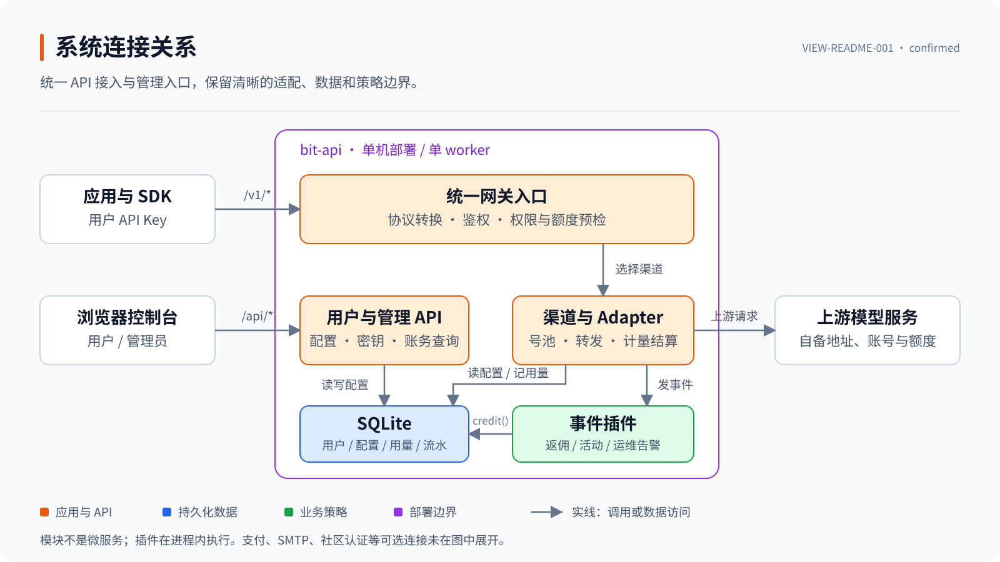
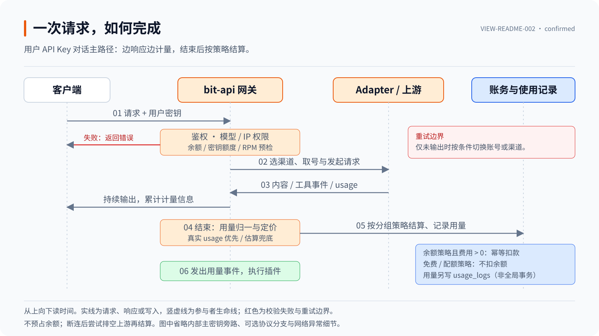

<p align="center">
  
</p>

<h1 align="center">bit-api</h1>

<p align="center"><strong>一个入口，连接多种模型。</strong><br>可自托管的轻量 LLM API 网关与运营控制台。</p>

<p align="center">Python · FastAPI · SQLite · 单进程部署 · MIT</p>

<p align="center">
  <a href="#快速开始">快速开始</a> ·
  <a href="#api-接入">API 接入</a> ·
  <a href="#架构与请求流程">架构与请求流程</a> ·
  <a href="#生产部署">生产部署</a> ·
  <a href="#文档导航">文档导航</a>
</p>

## 项目概览

bit-api 将多个上游模型服务统一为兼容 OpenAI 与 Anthropic 常用调用方式的 API，并提供用户、密钥、渠道、定价、用量和支付管理。你可以用它搭建团队内部的模型入口，也可以部署带用户自助控制台的 API 服务。

项目采用 **FastAPI + SQLite**，无需 Redis 或 PostgreSQL；前端资源随仓库自托管，无需 Node.js 或前端构建即可运行。渠道适配、支付接入和活动策略分别通过 Adapter、Payment Provider 与事件插件扩展。

**使用边界：**本项目是请求网关，不运行模型推理，也不附带上游账号、API Key 或免费额度。当前部署形态为单实例、单 worker；实际容量取决于上游延迟、请求类型、并发连接与运行环境，本仓库不提供未经压测的并发保证。

## 核心能力

| 能力 | 说明 |
| --- | --- |
| 多渠道接入 | 在管理台配置 OpenAI 兼容上游、模型映射、请求头与 Key 池；特殊上游可通过 Python Adapter 接入。 |
| 路由与调度 | 同一模型可关联多个渠道，支持优先级、同级权重、账号轮换、限流后的切换及渠道上下线。 |
| 协议转换 | 提供 Chat Completions、Responses、Anthropic Messages 与 Embeddings 接口；兼容范围见下方说明。 |
| 用户与密钥 | 邮箱注册、邀请码、API 密钥配额与模型限制、TOTP、找回密码，以及可选社区登录与账号绑定。 |
| 模型与体验 | 公开模型广场、价格筛选、对话 Playground、可复制端点和接入示例；Playground 与 API 共用计费路径。 |
| 定价与账务 | 按分组选择余额、配额或免费策略；支持模型通配、分组专属价、长上下文阶梯价、用量记录和余额流水。 |
| 运营工具 | 每日签到与可配置赠额区间、站内公告、订阅时长卡、兑换码、易支付充值、返佣插件及日志导出。 |
| 日常维护 | 上游号池巡检、SQLite 在线备份、SMTP 邮件、Webhook 告警、用户及全站运营看板。 |

模型广场展示的是配置允许的模型与价格，不是上游可用性承诺；实际调用还取决于账号状态、密钥权限、余额、额度和上游服务。

<details>
<summary>开发中的扩展：订阅号池与增强账号面板</summary>

以下内容对应尚未合入当前公开版本的开发工作，不属于上述基础功能的交付承诺：

- ChatGPT 与 Anthropic 订阅账号 Adapter，以及对应的凭据刷新与渠道配置。
- 账号表格的筛选、排序、分页、自定义列、可调度开关和自动刷新。
- 批量启停、重置、删除与测试；账号导入导出、单账号统计和上游错误回显。
- 上游返回数据时展示 5 小时 / 7 天用量窗口及重置时间。

账号导出涉及凭据明文，应按密钥文件管理。相关能力发布后再更新此处的状态说明。

</details>

## 快速开始

推荐使用 **Python 3.12**，与仓库的 Docker 基础镜像保持一致。需要 Git 和可访问上游服务的网络。下面先在本机启动，完成管理员初始化后再配置公网访问。

### 1. 获取代码

```bash
git clone https://github.com/kingenbomb/bitapi.git
cd bitapi
```

### 2. 安装并启动

**Linux / macOS**

```bash
python3.12 -m venv .venv
.venv/bin/python -m pip install -r requirements.txt
BITAPI_HOST=127.0.0.1 .venv/bin/python main.py
```

**Windows PowerShell**

```powershell
py -3.12 -m venv .venv
.\.venv\Scripts\python.exe -m pip install -r requirements.txt
$env:BITAPI_HOST = "127.0.0.1"
.\.venv\Scripts\python.exe main.py
```

打开 [本地控制台](http://127.0.0.1:8080/portal)。以上命令不启用支付、邮件或社区登录，不需要先配置这些可选服务。

> 本地示例明确绑定回环地址，仅用于开发体验。`python main.py` **不会自动读取 `.env`**；直接运行时请通过当前进程的环境变量配置。Docker Compose 和 systemd 分别通过 `env_file`、`EnvironmentFile` 加载配置文件。

### 3. 完成首次配置

1. **注册管理员。** 打开 `/portal#/register`；第一个通过邮箱注册的用户免邀请码并成为管理员。请在向公网开放前完成这一步。
2. **接入上游。** 进入「管理控制台 → 渠道」，添加 OpenAI 兼容渠道，填写上游地址、模型清单和必要映射，导入自己的 API Key，再执行渠道测试。Grok 等专用 Adapter 的凭据格式见 [渠道开发文档](docs/adapters.md)。
3. **确认分组与价格。** 检查默认分组允许哪些模型、采用哪种计费策略，并配置模型价格。首次初始化的默认分组采用 **免费策略**；仅填写价格并不会自动开启余额扣费。
4. **创建用户密钥。** 在「API 密钥」创建调用密钥，按需设置有效期、额度和模型范围。面向应用分发用户密钥，不分发内部主密钥或管理密钥。
5. **发起一次请求。** 从「模型广场」复制准确模型名，按下一节调用，再到「使用记录」核对结果与用量。

后续邮箱注册默认需要一次性邀请码，管理员可以调整注册策略。个人返佣码用于记录邀请关系，不能代替强制邀请制下的注册邀请码。

### 常用入口

| 路径 | 用途 | 访问说明 |
| --- | --- | --- |
| `/` | 公开落地页、端点与接入示例 | 无需登录；顶部可直达模型广场。 |
| `/portal#/plaza` | 模型广场 | 访客按默认分组查看目录与价格。 |
| `/portal` | 用户控制台与管理控制台 | 页面公开，用户及管理数据按身份鉴权。 |
| `/admin/ui` | 上游账号池面板 | 页面外壳公开，管理操作需要授权。 |
| `/v1/*` | 模型调用接口 | 使用用户 API Key 或内部网关主密钥。 |
| `/health` | 服务健康检查 | 无需鉴权；不执行上游模型探测。 |

## API 接入

应用使用自己部署的地址；不要把其他站点的域名或上游凭据写入客户端配置。

| 配置项 | 示例 |
| --- | --- |
| OpenAI 兼容 Base URL | `http://127.0.0.1:8080/v1` |
| Anthropic 兼容服务根地址 | `http://127.0.0.1:8080`（最终请求路径为 `/v1/messages`） |
| API Key | 在本站「API 密钥」中创建的用户密钥 |
| Model | 「模型广场」中可调用模型的完整名称 |

> 内部主密钥 `BITAPI_API_KEY` 会跳过用户计费与限流，不生成用户使用记录。它与“免费分组的用户密钥”不同，不应作为普通用户的接入凭据。

### 第一次调用

以下为 Bash 示例。把占位值替换为自己的**用户密钥**与模型名；真实密钥不要提交到仓库。

```bash
export BITAPI_BASE_URL='http://127.0.0.1:8080'
export BITAPI_USER_KEY='<YOUR_USER_API_KEY>'

# 查看当前密钥可访问的模型
curl --fail-with-body "$BITAPI_BASE_URL/v1/models" \
  -H "Authorization: Bearer $BITAPI_USER_KEY"

# 流式对话；将 <MODEL_ID> 替换为模型清单中的 id
curl --fail-with-body --no-buffer "$BITAPI_BASE_URL/v1/chat/completions" \
  -H "Authorization: Bearer $BITAPI_USER_KEY" \
  -H 'Content-Type: application/json' \
  -d '{
    "model": "<MODEL_ID>",
    "stream": true,
    "messages": [{"role": "user", "content": "你好，请简单介绍自己。"}]
  }'
```

### 协议兼容范围

“兼容”指当前实现支持的字段与事件，不表示完整复刻上游厂商的全部 API。

| 接口 | 主要用途 | 重要边界 |
| --- | --- | --- |
| `GET /v1/models` | 查询模型列表 | 目录受分组、密钥权限与渠道配置影响。 |
| `POST /v1/chat/completions` | 对话、SSE 流式、工具调用 | 具体参数、图片输入与工具能力取决于 Adapter 和上游模型。 |
| `POST /v1/responses` | Responses 风格客户端接入 | 无状态转换为 Chat；支持 function 工具，不保存 Response，不支持 `previous_response_id` 串联历史。 |
| `POST /v1/messages` | Anthropic Messages 风格调用 | 支持文本、图片与工具块的转换；不是所有原生能力的等价实现。 |
| `POST /v1/messages/count_tokens` | 请求 token 估算 | 使用本地估算，不是 Anthropic 官方计数服务。 |
| `POST /v1/embeddings` | 文本向量化 | 需要配置具备向量能力的 OpenAI 兼容上游及模型。 |

当前公开版本附带 Grok 与通用 OpenAI 兼容 Adapter。媒体生成路由是扩展入口，仓库并未附带可直接使用的图片或视频生成 Adapter。

## 架构与请求流程

### 系统连接关系



图 1 · `VIEW-README-001`：单机部署中的模块与外部连接，省略支付、邮件等可选集成。方框代表逻辑职责，不代表独立微服务。依据：[网关入口](server.py)、[控制台 API](routers/portal.py)、[渠道注册](core/channels.py)、[事件总线](core/hooks.py)。[打开可编辑 SVG](docs/images/system-map.svg)。

### 一次请求如何完成



图 2 · `VIEW-README-002`：使用**用户 API Key**的对话主路径，省略内部主密钥旁路及各协议转换细节。依据：[请求与流式处理](server.py)、[号池](core/pool.py)、[计量](core/metering.py)、[计费](core/billing.py)、[余额流水](core/credit.py)。[打开可编辑 SVG](docs/images/request-flow.svg)。

### 关键设计边界

| 设计 | 行为与取舍 |
| --- | --- |
| 流式切换 | 仅在尚未产生上游输出时尝试切换账号或渠道；开始输出后不把另一条上游响应拼接进原流。 |
| 用量归一 | 优先使用上游 usage；未提供时进行本地估算，并记录来源。估算值不保证与供应商账单完全一致。 |
| 结束后结算 | 不预占余额；余额策略在请求结束后按计量结果结算，因此并发在途请求可能使余额为负，后续请求由预检拦截。 |
| 断连处理 | 客户端断连后尝试排空上游以收集用量；异常结束与估算情况写入使用记录，不承诺任何故障下都能取得完整 usage。 |
| 价格快照 | 使用记录保存当次解析的价格、档位与倍率，便于检查历史计费口径。 |
| 幂等流水 | `credit()` 用稳定 `idem_key` 避免同一笔余额变动重复入账，并在同一事务写流水与更新余额；不等于整个请求跨表、跨插件全局原子。 |
| 策略扩展 | 插件订阅注册、充值、兑码、用量等事件；异常会被捕获，但处理器同步执行，耗时任务仍会影响响应时间。 |

核心负责鉴权、路由、计量与账务约束；Adapter 负责上游差异；插件负责返佣、活动和通知等策略。扩展时应通过 `credit()` 修改余额，而不是直接修改 `users.balance`。插件事件不是持久消息队列，也不提供自动重试承诺。示例与事件载荷见 [插件文档](docs/plugins.md)。

## 配置说明

完整样板见 [`.env.example`](.env.example)，配置读取规则见 [`config.py`](config.py)。新部署使用 `BITAPI_*` 前缀；部分站点设置、支付、邮件与渠道选项支持管理台存库覆盖环境默认值，不能假定修改环境变量就会覆盖已有配置。

| 配置 | 用途 | 建议 |
| --- | --- | --- |
| `BITAPI_JWT_SECRET` | 用户会话签名 | 生产使用独立的高强度随机值。 |
| `BITAPI_API_KEY` | 内部网关主密钥 | 仅供受控内部接入，不作为用户密钥分发。 |
| `BITAPI_ADMIN_KEY` | 上游号池管理密钥 | 仅管理员保存，不下发到业务客户端。 |
| `BITAPI_HOST` / `BITAPI_PORT` | 监听地址与端口 | 裸机反代用 `127.0.0.1`；容器内用 `0.0.0.0`。 |
| `BITAPI_SITE_URL` | 对外站点根地址 | 生产填写实际 HTTPS 域名，供回调与邮件链接使用。 |
| `BITAPI_DB` | SQLite 文件路径 | 指向持久、可写的位置；不要丢在临时容器层。 |
| `BITAPI_REQUIRE_INVITE` | 邮箱注册是否强制邀请码 | 默认开启；可在管理台调整。 |
| `BITAPI_DEFAULT_GROUP` | 新用户默认分组名称 | 同时检查该组的模型范围与计费策略。 |
| `BITAPI_CHECKIN_MIN` / `BITAPI_CHECKIN_MAX` | 每日签到赠额区间，美元 | 默认 `0.01`–`0.10`，管理台「站点设置」可覆盖。 |
| `BITAPI_TRUST_PROXY_HEADERS` | 是否信任代理传入的客户端地址 | 仅在受信任反代后使用；直接暴露应用时设为 `0`。 |
| `BITAPI_PAYMENT_PROVIDERS` | 支付渠道 | 默认空；生产不要启用 `mock`。 |
| `BITAPI_PLUGINS` | 启用的插件模块列表 | 逗号分隔；留空不启用插件。 |
| `BITAPI_BACKUP_INTERVAL` / `BITAPI_BACKUP_KEEP` | 备份间隔秒数与保留份数 | 默认每天一次、保留 7 份，另做异机备份。 |

三类密钥请分别生成，不要复用。例如运行下列命令三次，再将结果写入配置；**不要直接沿用样板中的占位文字**。

```bash
python -c "import secrets; print(secrets.token_urlsafe(32))"
```

启动预检会拒绝“非回环监听 + 代码默认密钥”的组合，但它不是密钥强度校验器，也不会替你识别所有弱密码或样板占位值。

<details>
<summary>可选服务：社区登录、邮件、支付与告警</summary>

- **社区登录：**需自行部署支持 `community-connect` 的 Flarum 社区，设置 `BITAPI_COMMUNITY_BASE_URL`、`BITAPI_COMMUNITY_CLIENT_ID`、`BITAPI_COMMUNITY_CLIENT_SECRET` 和完全匹配的 `BITAPI_COMMUNITY_REDIRECT_URI`。并非任意 Flarum 站点都能直接接入。首次通过社区创建本站账号始终需要一次性注册邀请码；已有用户在「个人资料 → 登录方式绑定」操作，不按同邮箱自动合并。
- **邮件：**在管理台「邮件设置」配置 SMTP 并发送测试邮件，用于密码找回与邮箱验证。未配置时相关发信功能不可用。
- **支付：**配置易支付商户信息、站点回调地址与启用渠道；`mock` 会将打开支付链接视为付款成功，只允许用于隔离测试环境。详见 [支付接入](docs/payments.md)。
- **告警：**启用 `BITAPI_PLUGINS=alert_webhook` 并设置 `BITAPI_ALERT_WEBHOOK_URL`，可对接 Telegram、Bark 或普通 Webhook。详见 [运维手册](docs/operations.md)。

</details>

## 生产部署

### Docker Compose

在已克隆的项目目录执行：

```bash
cp .env.example .env
# 编辑 .env：替换三个密钥，设置实际站点地址，确认支付和插件策略。
# 容器内保留 BITAPI_HOST=0.0.0.0；应用端口默认只映射到宿主回环地址。
docker compose up -d --build
docker compose logs -f bit-api
```

部署文件：[Dockerfile](Dockerfile) · [docker-compose.yml](docker-compose.yml) · [systemd 样板](deploy/bit-api.service) · [nginx 样板](deploy/nginx.conf.example)。

- **持久化：**Compose 将 `./data` 挂载到 `/data`，包含数据库、默认备份目录与缓存价目表。Linux 宿主机须让容器 UID `10001` 能写入该目录；权限不足时先修正目录权限，不要用全目录 `777` 规避。
- **公网入口：**宿主端口为 `127.0.0.1:8080`，通过 nginx 等反代提供 HTTPS；SSE 需关闭代理缓冲并配置合适的读取超时。
- **进程模型：**保持单实例、单 worker，不使用 `--workers N` 或多副本扩容现有部署。
- **升级与恢复：**升级前确认备份可恢复，使用 `git pull --ff-only` 后执行 `docker compose up -d --build`。启动会执行数据库迁移，不能把代码回退等同于数据库回退。

裸机部署与故障处理见 [部署指南](docs/deploy.md) 和 [运维手册](docs/operations.md)。systemd 部署使用的 `.env` 也应设置 `BITAPI_HOST=127.0.0.1`，不要直接沿用 Docker 样板的监听地址。

### 上线前检查

- [ ] 已初始化管理员，并替换三个默认密钥及样板占位值。
- [ ] 已启用 HTTPS，确认反代可信范围，不允许绕过反代直连应用端口。
- [ ] 已检查默认分组、模型范围、价格与计费策略，并完成一次真实上游调用。
- [ ] 未启用模拟支付；需要支付、邮件或社区登录时已完成各自联调。
- [ ] 已生成并验证数据库备份，同时单独备份 `.env`、自定义插件和反代配置。
- [ ] 已保护数据库、导出文件与备份的访问权限；它们可能包含用户数据和上游凭据。
- [ ] 已确认公开信息的范围：模型目录与默认分组价格、健康状态、页面外壳无需登录。

`/health` 返回成功只说明服务健康接口可响应，不代替渠道测试或真实请求验收。

## 开发与测试

本开源仓库当前未配置 CI。提交前由改动作者运行受影响的测试；涉及页面交互时还需浏览器回放。没有 CI 结果不应标为“CI 通过”。

```bash
python -m pip install -r requirements-dev.txt

# 单元与集成测试，不自动包含 e2e
python -m pytest tests/ -q

# 独立端到端测试：启动真实服务，使用 127.0.0.1:8123
python -m pytest tests/e2e -q
```

首页改动的定向检查：

```bash
python -m pytest tests/test_portal.py::PortalAssetCacheTest tests/test_portal.py::PortalPlazaTest::test_guest_sees_default_group_view -q
node --check static/landing.js
```

Node.js 仅用于上述开发校验，不是服务运行依赖。依赖文件固定了直接依赖版本，但不是完整的传递依赖锁文件；升级依赖时请单独验证并提交。

提交 Issue 或变更时，请提供复现步骤、预期行为、实际结果与相关测试；删除日志中的 API Key、Cookie、JWT 和个人信息，不上传真实 `.env` 或数据库。新增渠道、支付或插件请先阅读对应扩展文档。

## 文档导航

| 文档 | 内容 |
| --- | --- |
| [渠道与 Adapter](docs/adapters.md) | 数据配置渠道、自定义上游、凭据与能力声明。 |
| [定价](docs/pricing.md) | 价格解析、分组价、长上下文阶梯与种子数据。 |
| [插件](docs/plugins.md) | 事件载荷、返佣与活动策略、幂等入账。 |
| [支付](docs/payments.md) | 易支付、回调、订单及模拟支付的使用边界。 |
| [部署](docs/deploy.md) | Docker、systemd、反代与恢复操作。 |
| [运维](docs/operations.md) | 备份、SMTP、告警、限速与运营指标。 |

### 目录结构

```text
bitapi/
├── adapters/          # 上游适配器：Grok、通用 OpenAI 兼容渠道
├── core/              # 路由调度、计量计费、账务、安全与存储
├── routers/           # 用户与管理 REST API
├── payments/          # 支付 Provider
├── plugins/           # 返佣、活动、告警等事件插件
├── static/            # 自托管前端资源与模型图标
├── data/              # 定价种子；Docker 持久化挂载目录
├── deploy/            # systemd 与 nginx 配置样板
├── docs/              # 专题文档与 README 图表
├── tests/             # 单元、集成与独立 e2e 测试
├── home.html          # 公开落地页
├── portal.html        # 用户 / 管理控制台
├── dashboard.html     # 上游账号池面板
├── server.py          # FastAPI 应用与网关入口
├── config.py          # 环境配置
└── main.py            # 安全预检与单 worker 启动入口
```

## 许可证与使用责任

本项目基于 [MIT License](LICENSE) 发布。模型品牌图标来自 [LobeHub Icons](https://github.com/lobehub/lobe-icons) 项目，相关品牌与商标归其各自所有者。

使用者需自行取得上游服务及凭据的合法使用权限，并遵守相应服务条款、数据处理和访问限制。开源许可不授予任何第三方模型、账号、商标或服务的使用权。
